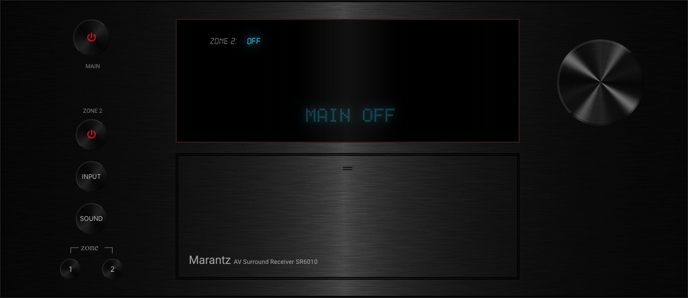
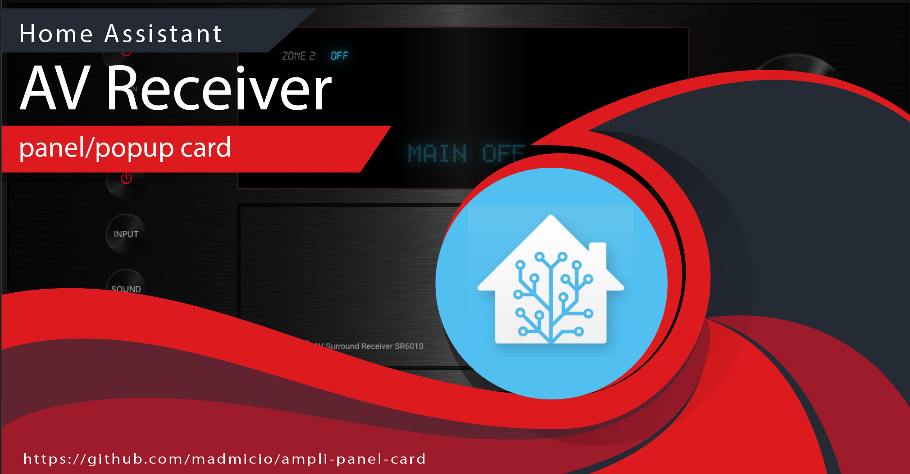

# AV Receiver Panel - Popup Card
Custom card for home assistant for the management of AV Receivers.
it is based on the media_player component thus increasing compatibility with various devices and brands



## Demo Video
[](https://youtu.be/-ai8dvM8xrc)

## Hacs Card Install

1. add madmicio/ampli-panel-card as custom reposity

2. Find and install `ampli-panel-card` plugin

2. Add a reference  inside your resources config:

  ```yaml
resources:
  - type: module
    url: /hacsfiles/ampli-panel-card/ampli-panel-card.js
```


### Manual install

1. Download and copy `ampli-panel-card.js` from (https://github.com/madmicio/ampli-panel-card/blob/master/dist/ampli-panel-card.js) into your custom components  directory.

2. Add a reference `ampli-panel-card.js` inside your resources config:

  ```yaml
  resources:
    - url: /local/"your_directory"/ampli-panel-card.js
      type: module
  ```

  # lovelace config example: 
```yaml
- entity: media_player.marantz_sr6010
  type: 'custom:ampli-panel-card'
  name: zona 1
  brand: Marantz
  info: AV Surround Receiver SR6010
  zone2: media_player.proiettore #(option)
```
### Main Options
| Name | Type | Default | Supported options | Description |
| -------------- | ----------- | ------------ | ------------------------------------------------ | --------------------------------------------------------------------------------------------------------------------------------------------------------------------------------------------------------------------------------------------------------------------------------------------------------------------------------------------- |
| `type` | string | **Required** | `custom:ampli-panel-card` | Type of the card |
| `entity` | string | **Required** |  | Av-Recevier madia_player entity |
| `name` | string | **Main Zone Receiver Name** | text | name of main zone |
| `brand` |  | **Receiver description**| text | Av-Receiver brand name|
| `info` |  | **Option**| text | Av-Receiver description |
| `zone2` |  | **Option**| text | enable zone2 (second hdmi output) |
| `name_zona2` | string | **Zone2 Receiver Name** | text | name of main zone | 